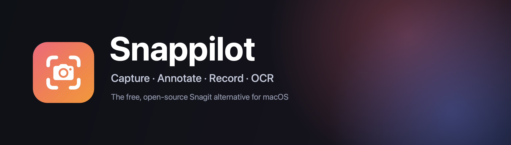
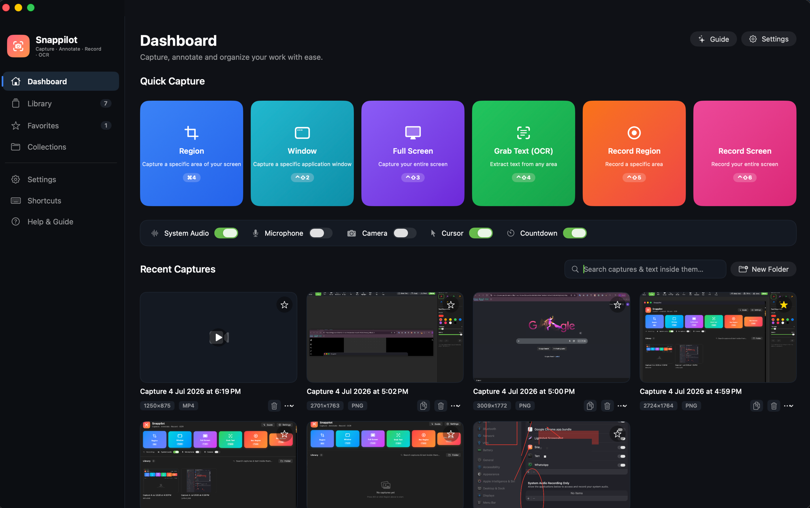
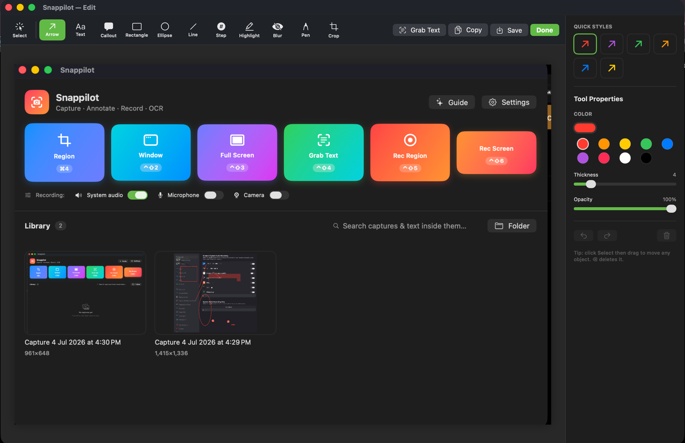

<p align="center">
  
</p>

<h1 align="center">Snappilot</h1>

<p align="center">
  <b>The free, open-source Snagit alternative for macOS.</b><br>
  Capture · Annotate · Record · OCR — native, on-device, and private.
</p>

<p align="center">
  
  
  
  
</p>

<p align="center">
  <a href="https://github.com/shipiit/snappilot/releases/latest/download/Snappilot.dmg">
    
  </a>
  &nbsp;
  <a href="https://github.com/shipiit/snappilot/releases/latest">
    
  </a>
  &nbsp;
  <a href="https://snappilot.vercel.app">
    
  </a>
  &nbsp;
  <a href="https://snappilot.vercel.app/docs">
    
  </a>
</p>

---

## 📥 Download & install

1. **[Download Snappilot.dmg](https://github.com/shipiit/snappilot/releases/latest/download/Snappilot.dmg)** from the latest release.
2. Open the `.dmg` and **drag Snappilot onto the Applications folder**.
3. First launch: **right-click Snappilot → Open** (the app is signed but not yet notarized),
   or run `xattr -cr /Applications/Snappilot.app`.
4. On first capture/record, allow **Screen Recording** (and Microphone / Camera if used) in
   **System Settings → Privacy & Security**.

> Prefer to build from source? See [Build & run](#️-build--run) below.

---

## ✨ Overview

Snappilot is a fast, modern **screen-capture studio** for macOS — think Snagit or CleanShot,
but **free, open-source, and 100% private**. Grab exactly the part of the screen you want,
annotate it in a Snagit-style editor, record it to a compact HEVC video (with a webcam
bubble, mic and countdown), and pull selectable text out of anything with on-device OCR.
Every capture auto-saves to a **searchable local library** — searchable even by the words
*inside* your screenshots.

Explore the interactive product experience at the **[Snappilot website](https://snappilot.vercel.app)**,
or visit the **[complete documentation](https://snappilot.vercel.app/docs)** for installation,
permissions, capture tools, recording, Meeting Mode, tasks, notes, architecture, and troubleshooting.

### Why Snappilot?

| | |
|---|---|
| 🆓 **Free & open source** | No license, no subscription, MIT-licensed. |
| 🔒 **Private by design** | 100% on-device. No telemetry, no accounts, no cloud. OCR runs locally via Apple Vision. |
| ⚡ **Native & fast** | Pure Swift + ScreenCaptureKit — lightweight, Retina-crisp, no Electron. |
| 🎨 **Genuinely powerful** | Magnifier capture, a full annotation editor, screen recording, video trim/annotation, GIF export, auto-redaction, and more. |

### Typical workflow

1. **Capture** — `⌃⇧1` and drag a region (or record with `⌃⇧5`).
2. **Annotate** — the editor opens; add arrows, callouts, step numbers, blur, stamps.
3. **Share** — **Copy**, **Save**, drag out, or turn a recording into a **GIF**.
4. **Find it later** — it's in your library, searchable by its OCR'd text.

<table>
  <tr>
    <td width="50%" align="center" valign="top">
      <br><br>
      <b>🏠 Dashboard</b><br>
      <sub>Colorful quick-capture cards (Region · Window · Full Screen · Grab Text · Record),
      one row of recording options (system audio · mic · camera · cursor · countdown · quality),
      and a searchable library of every capture — with copy, favorite &amp; delete.</sub>
    </td>
    <td width="50%" align="center" valign="top">
      <br><br>
      <b>✏️ Annotation editor</b><br>
      <sub>Snagit-style toolbar (arrow, text, callout, shapes, step, highlight, blur, pen,
      stamp, crop), a live <b>Quick Styles</b> preset grid, and <b>Tool Properties</b>
      (color, thickness, opacity, arrow start/end/size) on a clean canvas.</sub>
    </td>
  </tr>
</table>

## 🚀 Features

### Capture
- 🟦 **Region** · 🪟 **Window** · 🖥️ **Full Screen** — a crisp crosshair overlay with a
  **live magnifier loupe**, pixel dimensions, and keyboard hints.
- ⏱️ **Delay timer** — 3s/5s countdown before a screenshot.
- ⌨️ **Global shortcuts** — trigger any capture from anywhere. Fully **customizable**.
- 🫥 Snappilot **hides itself** during capture so it never lands in your shot.

### Annotate (Snagit-style editor)
- ➡️ Arrows, lines, rectangles, ellipses, callouts, freehand pen
- 🔢 **Step badges** — auto-numbered `1·2·3`, `A·B·C`, or `a·b·c`
- 🖍️ Highlighter · 🙈 **Blur / redact** · ✂️ **Crop** · ⭐ **Stamps** (emoji)
- 🛡️ **Auto-redact** — one click blurs detected emails & card numbers (on-device OCR)
- 🖼️ **Polished frames** — wrap a shot in a gradient background + shadow for sharing
- 🎨 **Quick Styles** — 10+ one-click presets per tool (solid / dashed / dotted, dot & bar
  arrow heads, fills, colors)
- 🎚️ Tool properties: custom color, thickness, opacity, arrow **start/end/size**
- ↩️ Non-destructive layers, undo/redo, move & edit anything

### Record
- 🎥 Record a **region or the full screen** → compact **HEVC MP4** (Small / Balanced / High quality)
- 🔊 System audio · 🎙️ Microphone · 📷 **Webcam overlay** · 🖱️ cursor — all optional
- 🎙️ **Microphone noise cancellation** — voice-processed mic (noise suppression + echo cancellation)
- ⏸️ **Pause / Resume** — the paused span is stitched out cleanly
- ⏱️ **"Ready to Record"** panel + **3·2·1 countdown** (outside the frame) + a live **frame indicator**
- ✍️ **Draw on screen while recording** — pen, highlighter, a fading **laser pointer** & arrows,
  captured into the video. Ink **auto-fades** when you stop, Google-Meet style (press `Esc` to exit).
- 📸 **Screenshot while recording** — grab a still without stopping the recording
- ▶️ Recordings open in Snappilot's **own player** — never QuickTime — with **Trim**,
  **Annotate** (draw on a frame, baked over the whole clip), and **GIF export**

### 🧠 Meeting Mode (on-device AI)
- 🎙️ **Record a call** (Google Meet / Zoom) and get an automatic **transcript** — all processed
  **on your Mac**, nothing uploaded.
- 🗣️ Speakers split into **You vs Participants** automatically (mic vs system audio); real
  **per-speaker names** are read from **Google Meet's live captions** when they're on.
- ✅ Auto-generated **Summary, Action Items & Key Points** — saved as Markdown next to the
  recording, searchable, and one-click **imported into the task board**.

### 📸 Capture, extended
- 📜 **Scrolling capture** — auto-scroll a long page and stitch it into one tall image
- 🗂️ **Collections** — drag captures into named groups · 🏷️ **tags** · 📌 **Pin to Screen**
- 📄 **PDF export** — pick images and export a multi-page PDF

### ✅ Tasks — a Linear-style board
- 🗂️ Board **To do / In progress / Review / Done** + a **List view**; **drag** cards to change status
- 🔑 Issue-key chips · 🚩 priority · 🏷️ labels · 👤 assignee avatars · subtask **progress bars**
- 📝 Full task detail page: **Markdown** description, **subtasks with their own descriptions**,
  **comments** (Markdown), activity history, image/file **attachments**
- 🔔 **Due-date reminders** (local notifications) · ⬆️ export to Markdown / **Apple Reminders**

### 📓 Notes — a Markdown workspace
- ✍️ **Live split editor** — raw Markdown ↔ rendered preview, updating as you type
- 🖼️ **Images in Markdown** (insert, drag-and-drop, `` renders inline)
- ⭐ favorite · 📌 pin · 🗄️ archive · duplicate · export; search; word count & reading time
- 🧭 Notes list lives in the **collapsible** main sidebar for a distraction-free editor

### OCR & Library
- 🔤 **Grab Text** — extract selectable text from any region via Apple Vision
- 🗂️ Every capture **auto-saves** to a local library, **searchable by the text inside it**
- ⭐ Favorites · 📋 copy · 🗑️ delete · 🔎 instant search · 💾 live **storage usage** in the sidebar

### Design
- 🌗 Full **light & dark** theme support (follows your system)
- 🧭 Clean **collapsible** sidebar dashboard · menu-bar quick access · full app menu with shortcuts

## ⌨️ Default shortcuts

| Shortcut | Action |          | Shortcut | Action |
|----------|--------|----------|----------|--------|
| `⌃⇧1`    | Region |          | `⌃⇧6`    | Record Screen |
| `⌃⇧2`    | Window |          | `⌃⇧7`    | Scrolling Capture |
| `⌃⇧3`    | Full Screen |     | `⌃⇧8`    | Record Meeting |
| `⌃⇧4`    | Grab Text (OCR) | | `⌃⇧.`    | Stop Recording |
| `⌃⇧5`    | Record Region |  |          | *(all customizable in Settings)* |

## 🛠️ Build & run

Requires **macOS 14+**, **Xcode 16+**, and [XcodeGen](https://github.com/yonaskolb/XcodeGen)
(`brew install xcodegen`).

```bash
xcodegen generate        # creates Snappilot.xcodeproj
open Snappilot.xcodeproj  # then Run (⌘R)

swift run snapverify      # framework-free logic tests for SnapCore
```

On first capture/record, macOS asks for **Screen Recording** (and, if used, Microphone /
Camera) permission — enable Snappilot in **System Settings → Privacy & Security**.

## 🏗️ Architecture

- **`SnapCore`** — a UI-free, unit-tested Swift package: capture/crop geometry, the Vision
  OCR wrapper, image ops, sensitive-data detection, the annotation layer model, and the
  local-library index.
- **`App`** — SwiftUI + AppKit: capture overlay, ScreenCaptureKit controller, the
  annotation editor, recorder, video player, menu-bar UI, hotkeys, and settings.

Logic lives in `SnapCore` so it can be tested without a UI; everything visual consumes it
through clean value types.

## 🗺️ Roadmap

**Shipped:** ✅ Meeting Mode · ✅ Scrolling capture · ✅ Collections & tags · ✅ PDF export ·
✅ Pause/Resume · ✅ Noise cancellation · ✅ Task board · ✅ Notes workspace

**Next:**
- Timeline view + Filter / Sort / Group on the task board
- Per-subtask due dates & assignees · linked issues
- Note folders & backlinks · slash-commands in the editor
- Templates / step-guides · quick share

## 🤝 Contributing

Contributions are welcome! Please read **[CONTRIBUTING.md](CONTRIBUTING.md)** first.

- 🐛 [Report a bug](https://github.com/shipiit/snappilot/issues/new/choose)
- 💡 [Request a feature](https://github.com/shipiit/snappilot/issues/new/choose)
- 🔀 `main` is protected — changes land via **pull request** with review.

## 🛡️ Security

Found a vulnerability? Please report it **privately** — see **[SECURITY.md](SECURITY.md)**.
Do not open a public issue for security problems.

## 🔒 Privacy

100% on-device. No telemetry, no third-party services, no account. OCR runs locally via
Apple Vision; recordings and captures never leave your Mac.

## 📄 License

MIT.
